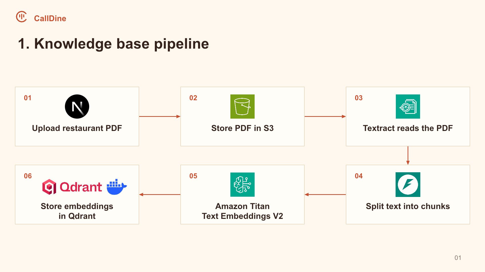
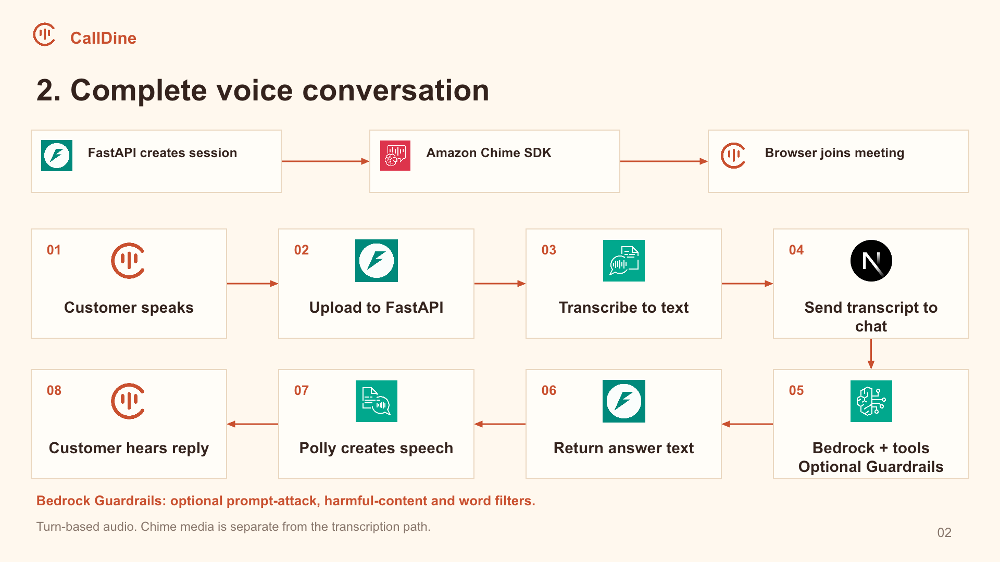
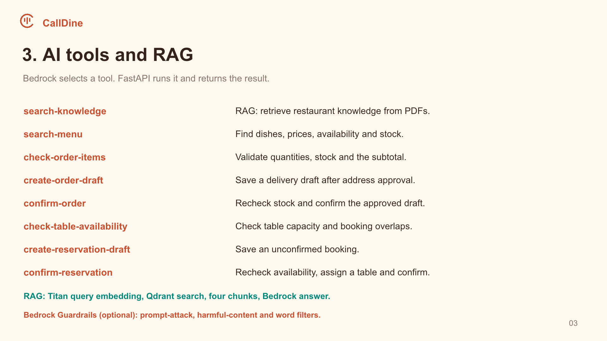
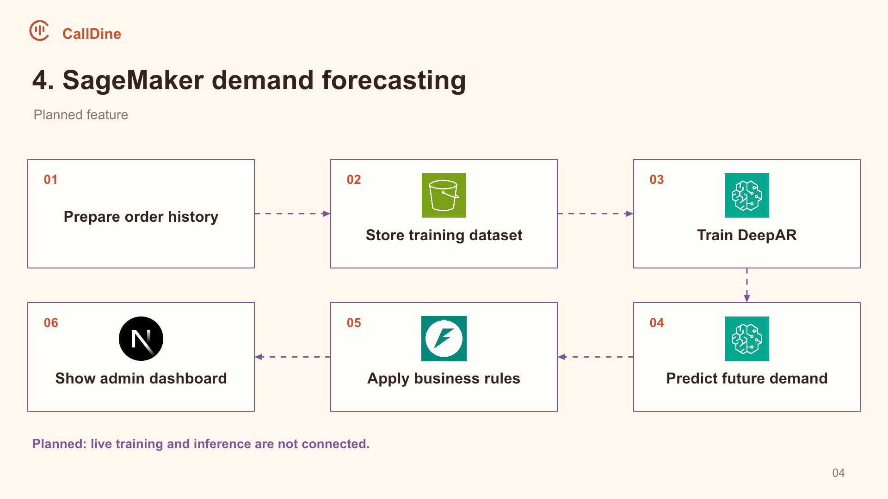
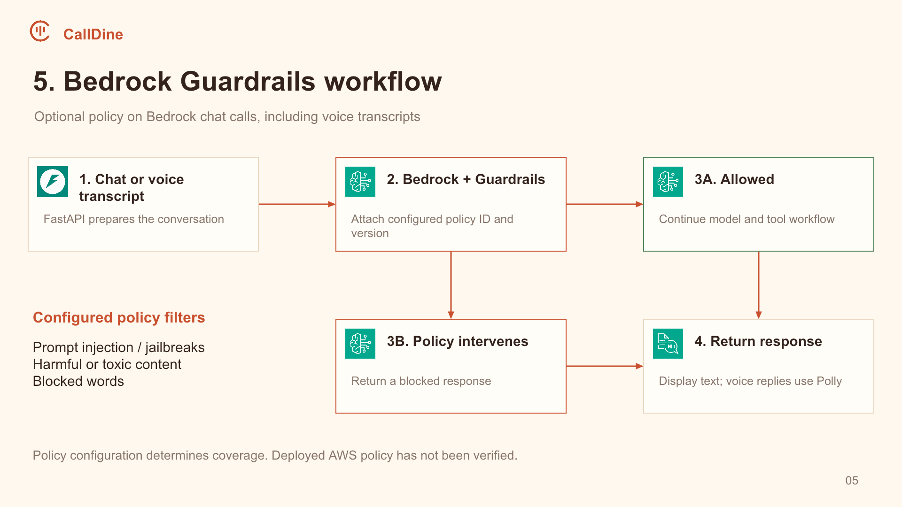

<div align="center">
  
  <h1>CallDine</h1>
  <p>A demo restaurant assistant built with Python, Next.js and AWS.</p>
</div>

[](https://www.youtube.com/watch?v=02UnSYEdlA8)

<p align="center">
  <a href="https://www.youtube.com/watch?v=02UnSYEdlA8"> Watch the demo on YouTube</a>
</p>

## The idea

Restaurant staff often answer the same questions while taking orders and managing bookings. CallDine explores how an AI assistant can handle those conversations through chat or a browser voice call.

A customer can ask about the menu, order food for delivery or reserve a table. The assistant collects missing details and asks for confirmation. Staff can then review the order, reservation and conversation in the admin dashboard, where they also manage menu stock and upload restaurant knowledge.

## Technologies

| Part | Technologies |
| --- | --- |
| Web application | Next.js, React, TypeScript |
| API and application data | FastAPI, SQLModel, SQLite |
| AI and knowledge search | Amazon Bedrock (OpenAI GPT-OSS 20B), Titan Text Embeddings V2, Qdrant |
| Voice | Amazon Chime SDK, Transcribe, Polly |
| Documents and storage | Amazon S3, Textract |
| Content filtering | Amazon Bedrock Guardrails, optional |
| Local infrastructure | Docker Compose for Qdrant |

## Architecture

Next.js provides the customer and admin interfaces. FastAPI coordinates the AI and AWS services, while repositories handle SQLite data. The following slides show each workflow.

### 1. Restaurant knowledge



An admin uploads a PDF to S3. Textract extracts its text, and FastAPI splits it into chunks. Titan converts each chunk into an embedding, a numerical representation of its meaning. Qdrant stores the embeddings alongside the source text for later search.

### 2. Voice conversations



FastAPI creates a Chime meeting for the browser to join. The browser uploads each recorded speech turn to FastAPI, which uses Transcribe to return text. The chat service processes the request, then Polly produces the spoken reply. Chime manages the call session separately from the transcription path.

### 3. AI tools and RAG



Bedrock selects tools, and FastAPI executes them against restaurant data. For knowledge questions, Titan embeds the question and Qdrant retrieves four relevant passages for the answer. This is retrieval-augmented generation, or RAG. Order and reservation tools create drafts, then recheck stock or table availability when confirming. SQLite keeps conversation history between visits.

### 4. Demand forecasting, planned



The proposed pipeline uses daily order history in S3 to train SageMaker DeepAR and predict demand. The current recommendations page uses static demo values. Training and inference are not connected.

### 5. Bedrock Guardrails



When a guardrail ID and version are configured, FastAPI includes them in Bedrock requests. If the policy intervenes, the assistant returns a blocked response. The filters depend on the policy configured in AWS and also apply to voice transcripts.

## Run the demo

Use Python 3.11+, Node.js 20.9+, Docker and AWS credentials with access to the services above. These commands use Bash and Make, available on Linux, macOS or WSL.

```bash
cp backend/.env.example backend/.env
cp Frontend/.env.example Frontend/.env.local
docker compose up -d
make install
make dev
```

Before starting, replace the placeholders in `backend/.env` with your AWS and S3 settings. Leave both Guardrail variables empty to run without a policy.

Open [localhost:3000](http://localhost:3000). Docker Compose runs Qdrant only; Next.js and FastAPI run locally.

Demo accounts:

- Customer: `custmer@custmer.com` / `password`
- Admin: `admin@admin.com` / `password`
